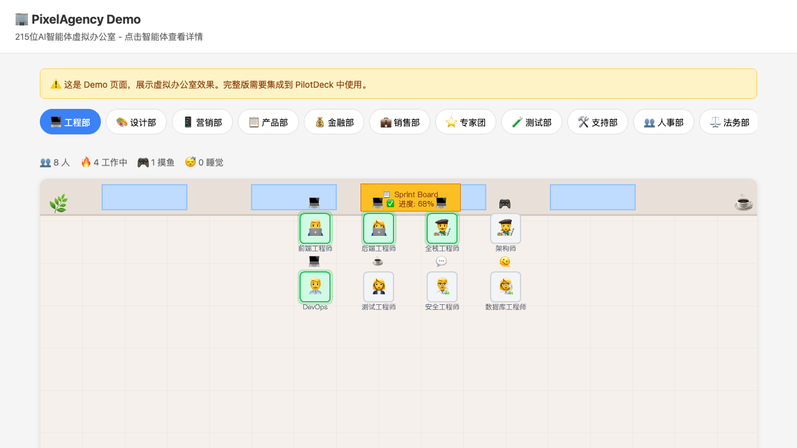

# 🎮 PixelAgency

> 215 位 AI 智能体组成的虚拟办公室 — 让你的 AI 团队"活"起来

<p align="center">
  
  
  
  
</p>

<p align="center">
  
</p>

---

## ✨ 这是什么？

PixelAgency 是一个**游戏化的 AI 智能体调度系统**。它把 215 个专业 AI 智能体以**像素风游戏角色**的形式展现在一个虚拟办公室里，每个智能体都有自己的"生活"——工作、摸鱼、打游戏、睡觉、喝咖啡...

当你和 LLM 对话时，秘书系统会智能判断是否需要调用专业智能体。被调用的智能体会在虚拟办公室里实时显示为"工作中"状态，让你**直观地看到 AI 团队的协作过程**。

## 🎯 核心理念

| 概念 | 说明 |
|------|------|
| 🪞 **镜子，不是笼子** | 虚拟办公室反映真实状态，而非强制行为 |
| 🧠 **LLM 是秘书** | 由 LLM 自主决定是否调用智能体，保留创造力 |
| 🎮 **游戏化呈现** | 像素风角色 + 7 种行为状态 + 动画效果 |
| 🪶 **极致轻量** | Canvas 2D 渲染，零图片资源，4GB 服务器可运行 |

## 📦 项目结构

```
PixelAgency/
├── agency-agents-zh/          # 215 位智能体定义文件（.md）
│   ├── engineering/           # 工程部
│   ├── design/                # 设计部
│   ├── marketing/             # 营销部
│   ├── product/               # 产品部
│   ├── finance/               # 金融部
│   ├── sales/                 # 销售部
│   └── ...                    # 共 17 个部门
├── agent-index.json           # 智能体索引（自动生成）
├── prompts/
│   └── secretary.md           # LLM 秘书系统提示词
├── scripts/
│   └── load-agents.mjs        # 智能体加载脚本
└── PRD.md                     # 产品需求文档
```

## 🏢 17 个部门，215 位智能体

| 部门 | 人数 | 职责 |
|------|------|------|
| 💻 工程部 | 35 | 前端、后端、DevOps、安全、嵌入式 |
| 🎨 设计部 | 8 | UI/UX、品牌、动效、3D |
| 📱 营销部 | 32 | SEO、社交媒体、内容、增长 |
| 📋 产品部 | 5 | 产品经理、需求分析、用户研究 |
| 💰 金融部 | 8 | 财务分析、税务、投资、审计 |
| 💼 销售部 | 8 | 大客户、商务拓展、客户成功 |
| 🎮 游戏开发 | 20 | Unity、Unreal、Godot、Roblox |
| ⭐ 专家团 | 37 | AI、区块链、云计算、物联网 |
| 🧪 测试部 | 9 | 自动化、性能、安全测试 |
| 📊 项目办 | 6 | 项目管理、Scrum、敏捷 |
| ... | ... | 共 17 个部门 |

## 🎮 智能体的 7 种状态

```
💻 工作中  — 被 LLM 调用执行任务（绿色发光）
🎮 打游戏  — 空闲摸鱼
😴 睡觉中  — 长时间未激活
☕ 喝咖啡  — 短暂休息
💬 聊天中  — 与其他智能体交流
🫠 发呆中  — 等待任务
🚶 走动中  — 切换状态（有移动动画）
```

## 🔧 技术实现

### 前端渲染
- **Canvas 2D** — 纯代码绘制，零图片资源
- **像素风角色** — 48×48px 方块人 + emoji + 行为气泡
- **动态布局** — 根据部门人数自动调整网格
- **实时动画** — 60fps，工作状态发光脉冲

### LLM 集成
- **PILOTDECK.md** — 注入系统提示词，告知 215 个智能体
- **agent 工具调用** — `agent({ subagent_type: "general-purpose", prompt: "你是「XX角色」..." })`
- **智能判断** — 简单问题直接回答，复杂问题调度智能体

### 状态同步
- **WebSocket** — 实时监听 `tool_use` / `tool_result` 事件
- **角色匹配** — 从 prompt 中解析角色名，匹配 agent-index
- **localStorage** — 持久化工作状态

## 🚀 快速开始

### 1. 克隆仓库
```bash
git clone https://github.com/feifeida57/PixelAgency.git
cd PixelAgency
```

### 2. 生成智能体索引
```bash
node scripts/load-agents.mjs
```

### 3. 集成到 PilotDeck
将以下文件复制到 PilotDeck 项目：
```bash
# 智能体索引
cp agent-index.json /path/to/PilotDeck/ui/src/data/

# 系统提示词
cp -r .pilotdeck /path/to/PilotDeck/

# 虚拟办公室组件
# 将 VirtualOfficeV2.tsx 放到 PilotDeck/ui/src/components/main-content-v2/
```

### 4. 启动 PilotDeck
```bash
cd /path/to/PilotDeck
npm run dev
```

访问 `http://localhost:5174`，点击"虚拟办公室"标签即可看到效果。

### 🎮 快速体验 Demo

想直接看效果？运行 Demo：
```bash
npm install
npm run demo
```

然后访问 http://localhost:8080，即可看到虚拟办公室 Demo。

## 💡 工作原理

```
用户发送消息
    ↓
LLM 接收（包含 PILOTDECK.md 系统提示词）
    ↓
LLM 判断：简单问题 → 直接回答
          复杂问题 → 调用 agent 工具
    ↓
agent({ prompt: "你是「财务分析师」。分析..." })
    ↓
WebSocket 推送 tool_use 事件
    ↓
虚拟办公室解析角色名 → 匹配智能体 → 显示「工作中 💻」
    ↓
智能体完成 → tool_result → 恢复空闲状态
```

## 🎨 自定义

### 添加新智能体
在 `agency-agents-zh/部门名/` 下创建 `.md` 文件：
```markdown
---
name: 新智能体名称
description: 智能体描述
emoji: 🎯
color: "#FF6B6B"
---

# 系统提示词内容...
```

然后重新运行 `node scripts/load-agents.mjs` 更新索引。

### 修改行为权重
在 `VirtualOfficeV2.tsx` 中调整：
```typescript
const BEHAVIOR_WEIGHTS = [
  { behavior: 'working', weight: 0.45 },   // 45% 概率工作
  { behavior: 'gaming', weight: 0.15 },    // 15% 概率摸鱼
  { behavior: 'sleeping', weight: 0.12 },  // 12% 概率睡觉
  // ...
];
```

## 📄 相关文档

- [PRD.md](./PRD.md) — 产品需求文档
- [secretary.md](./prompts/secretary.md) — LLM 秘书系统提示词
- [ROADMAP.md](./ROADMAP.md) — 发展路线图
- [docs/architecture.md](./docs/architecture.md) — 架构设计文档
- [UPSTREAM.md](./UPSTREAM.md) — 上游来源与原创声明
- [demo/index.html](./demo/index.html) — 可运行 Demo
- [ROADMAP.md](./ROADMAP.md) — 发展路线图
- [docs/architecture.md](./docs/architecture.md) — 架构设计文档
- [UPSTREAM.md](./UPSTREAM.md) — 上游来源与原创声明
- [demo/index.html](./demo/index.html) — 可运行 Demo

## 🤝 贡献

欢迎提交 Issue 和 PR！

## 📝 License

MIT

---

<p align="center">
  <i>让 AI 团队不再只是代码，而是一个有"生命"的办公室</i>
</p>
